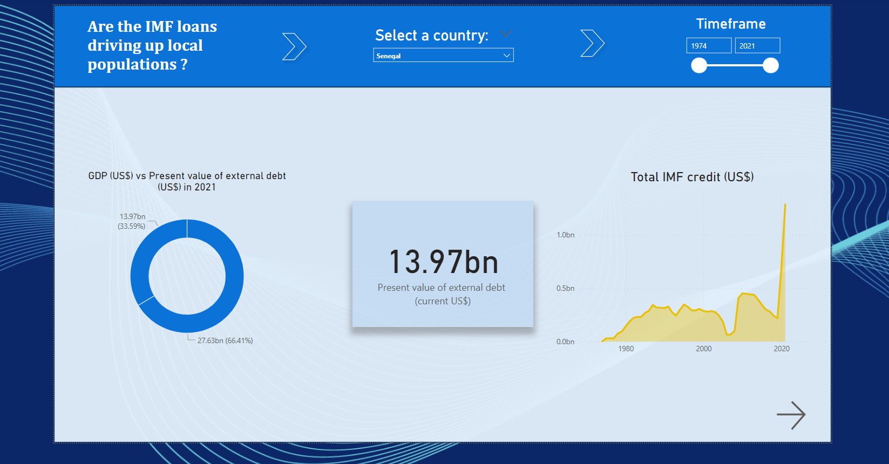

# IMF-Impact---Viz-PowerBI 🖼️

#### What is the impact of IMF loans towards borrowers' GDP and Poverty Statistics. 🌍

## Context 📋

#### What if IMF loans had a negative impact towards developping country ? 

This is the statement of ALEX GLADSTEIN who published a study called "STRUCTURAL ADJUSTMENT: HOW THE IMF AND WORLD BANK REPRESS POOR COUNTRIES AND FUNNEL THEIR RESOURCES TO RICH ONES".   
    "The IMF and World Bank do not seek to fix poverty, but only to enrich creditor nations. Could Bitcoin create a better global economic system for the developing world?"  

Based on Alex's study, IMF loans are high interest debt, loaned in strong currency, usually USD.   
- Those loans obligates the developping country in exporting goods to earn USD.   
- This switch in the economy benefits developped country which can import cheap goods.  
- This switch towards exportation prevents population from producing for themselves. Thus, the importations increase.

This is the visualisation of the previous data extraction done here : https://github.com/AxelCrypto/IMF-Impact

In this data extraction I made a random sample of 5 countries to the ones I added Argentina for personal curiosity. 

## Objectives 🥅

For each country: 
- Are the GDP, Poverty, Exports, Imports, Debt Charges, Inflation, correlation with IMF loans per year ? 

## Interpretation 📋 

### 1- Landing Page  

#### Selection:
1st: Select the country 
Optional: Select the TimeFrame

#### Analysis: 

- Observe on the left side, for the year 2021, the present value of the total external debt vs the total GDP. (USD)  

- In the center, the mentioned present value of external debt.  

- In the right, the chart of IMF debt per year (USD).  

### 2- Chart Page 1  

- Find again the Total IMF Credit in USD on the left

- Total Cost of External Debt vs Total Export:
    External debt is often denominated in USD, which obligates the country to increase its exports. If the cost of external debt is going up, are the exports also going up? This would confirm the correlation and the need for exports to reimburse the external debt.

- IMF's Debt Charges vs Current Account (%):
    We are comparing the charges for the IMF's debt only with the Current Account Balance, which is basically the difference between exports and imports. The IMF charges in USD, which can obligate developing countries to increase their exports to obtain USD to reimburse the debt.   
    If the current account is negative, meaning imports are growing quicker than exports, the population may not be able to produce enough for themselves anymore.

### 3- Chart Page 2

- Find again the Total IMF Credit in USD on the left

- %GDP growth vs %inflation growth:
    Is the GDP growing and is inflation under control?   
    A growing GDP but high inflation would negatively impact the population due to the Cantillon effect. Inflation affects the poor and benefits the rich.  

- Income share held by the highest 10% vs lowest 10%:
    If the economy improves, does it benefit the whole population or just the wealthy?

## Results 🔦

Based on the data for the 6 countries selected: 
- They all depend more and more of IMF.
    -> Indeed mentioned by Alex and all its bad dependency it creates.   
- Fo all, exports skyrocked at high pace. But all have a negative Current Account Balance which points down. Showing that they increased their dependency. 
    -> It may confirm that their shift towards exportation obligate the population to import rather to produce. 
- None shows brutal improvement in %GDP growth. The most indebted one (Argentina) shows the worst inflation figures. 
    -> GDP are stable and don't seem correlated to IMF's loans. Many have high inflation rates which will impact negatively the population but as well the country's ability to reimburse external detb.
- Poverty: 
    - El Salvador's 10% poorest has slightly improved their income's share. 
    - Argentina's 10% poorest seemed to improve from 2000 to 2014. This period was period of low IMF debt charges and loan. 
    - Other countries don't see progress in inequalities.
    